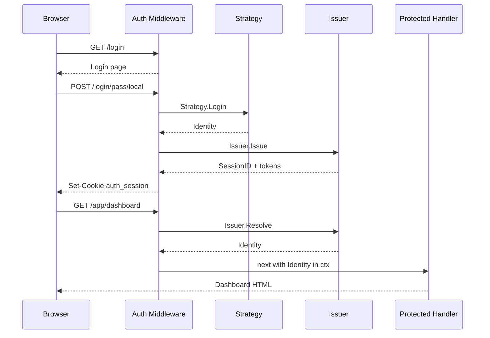
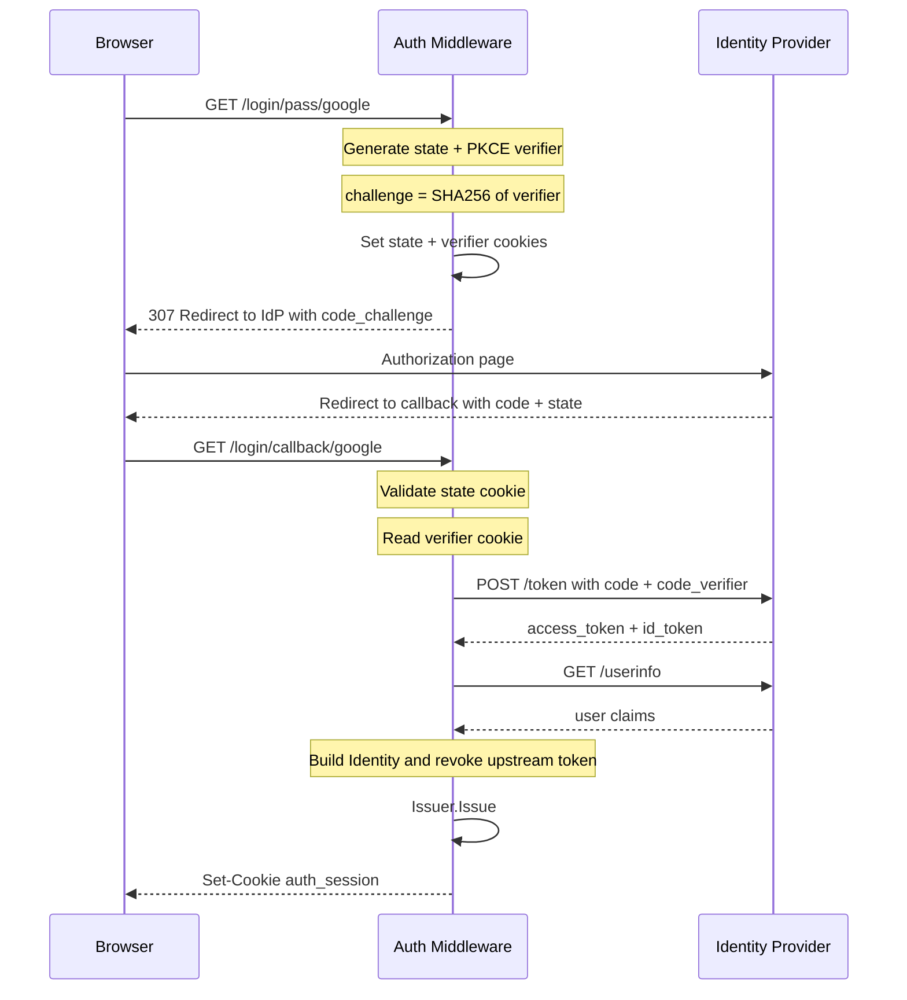
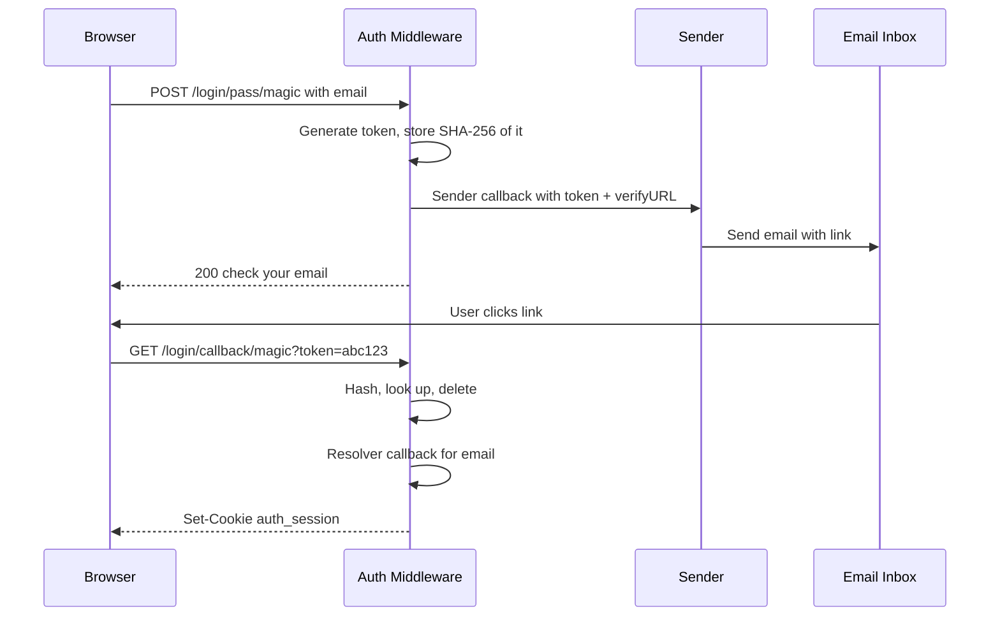

# Auth

Auth middleware provides a pluggable authentication system with session management, a built-in login UI, and support for multiple authentication strategies (local credentials, OAuth2/OIDC, custom).

```go
"github.com/rakunlabs/ada/middleware/auth"
"github.com/rakunlabs/ada/middleware/auth/strategy/local"
authoauth2 "github.com/rakunlabs/ada/middleware/auth/strategy/oauth2"
```

## How It Works

Authentication is a **one-shot event**. A strategy (OAuth2, local, etc.) verifies the user's identity once and returns a normalized `Identity`. The middleware then mints its own opaque session token — the upstream IdP token is discarded immediately (optionally revoked). Every subsequent request resolves the session cookie through the internal issuer, never touching the IdP again.



## Quick Start

```go
import (
    "github.com/rakunlabs/ada/middleware/auth"
    "github.com/rakunlabs/ada/middleware/auth/identity"
    "github.com/rakunlabs/ada/middleware/auth/strategy/local"
)

authMW := auth.New(auth.Config{
    UI: auth.UIConfig{
        Title:    "My App",
        Subtitle: "Sign in to continue",
    },
})

authMW.Strategy(local.New("local",
    func(ctx context.Context, user, pass string) (*identity.Identity, error) {
        // Your credential check (database, LDAP, etc.)
        if user == "admin" && pass == "secret" {
            return &identity.Identity{
                Subject: "admin",
                Email:   "admin@example.com",
                Roles:   []string{"admin"},
            }, nil
        }
        return nil, local.ErrInvalidCredentials
    },
    local.WithLabel("Email & password"),
))

if err := authMW.Init(ctx); err != nil {
    return err
}

// Mount public auth routes
authMW.Mount(mux)

// Protect routes
app := mux.Group("/app")
app.Use(authMW.Require())
app.GET("/dashboard", func(w http.ResponseWriter, r *http.Request) {
    id := identity.FromContext(r.Context())
    fmt.Fprintf(w, "Hello, %s", id.Name)
})
```

## Strategies

### Local Strategy

The local strategy authenticates using a user-supplied `Verifier` function. You own the credential check — it can be a database lookup, LDAP bind, bcrypt comparison, or anything else.

```go
import "github.com/rakunlabs/ada/middleware/auth/strategy/local"

authMW.Strategy(local.New("local",
    myVerifierFunc,
    local.WithLabel("Email & password"),
    local.WithPriority(0),
    local.WithFields(
        strategy.Field{Name: "email", Label: "Email", Type: "email", Required: true},
        strategy.Field{Name: "password", Label: "Password", Type: "password", Required: true},
    ),
))
```

The `Verifier` signature:

```go
type Verifier func(ctx context.Context, username, password string) (*identity.Identity, error)
```

Return `local.ErrInvalidCredentials` for bad credentials (produces 401). Any other error produces 500.

Add a limiter, and use `password` for the hash — the two things a credential
strategy needs that nothing else supplies:

```go
g := guard.New(guard.Config{}) // 5 failures, escalating lockout
defer g.Close()

authMW.Strategy(local.New("local", myVerifierFunc, local.WithLimiter(g)))
```

Only `ErrInvalidCredentials` counts against the account. An unexpected error is
a server fault, and counting it would let a database outage lock out every
user.

#### Self-Service Sign-up

The local strategy can also create accounts. Pass a `Registrar` with `local.WithRegistrar(...)` — its presence enables signup for that strategy and the login UI grows a "Sign up" toggle.

```go
authMW.Strategy(local.New("local",
    LocalVerifier,
    local.WithLabel("Username & password"),
    local.WithRegistrar(func(ctx context.Context, req local.RegisterRequest) (*identity.Identity, error) {
        if len(req.Password) < 6 {
            return nil, fmt.Errorf("password must be at least 6 characters: %w", local.ErrInvalidInput)
        }

        user, err := db.CreateUser(ctx, req.Username, req.Password)
        if errors.Is(err, db.ErrDuplicate) {
            return nil, local.ErrUserExists
        }
        if err != nil {
            return nil, err
        }

        return &identity.Identity{
            Subject: user.ID,
            Name:    user.Name,
            Roles:   []string{"user"},
        }, nil
    }),
    local.WithAutoLogin(true),  // optional: issue a session immediately on success
))
```

The `Registrar` signature:

```go
type Registrar func(ctx context.Context, req local.RegisterRequest) (*identity.Identity, error)

type RegisterRequest struct {
    Username string
    Password string
    Extras   map[string]string  // any non-username/password fields from the form
}
```

Error contract:

| Return | HTTP | Use when |
|---|---|---|
| `nil` error | 200 | Account created |
| `local.ErrUserExists` | 409 | Username already taken |
| `local.ErrInvalidInput` (wrap with `fmt.Errorf("... : %w", local.ErrInvalidInput)`) | 400 | Validation failed; wrapped message is shown to the user |
| any other error | 500 | Unexpected failure |

**Customizing the sign-up form** — by default the form is `username`, `password`, `password_confirm` (all with matching labels). Override with `local.WithRegisterFields(...)`:

```go
local.WithRegisterFields(
    strategy.Field{Name: "username", Label: "Email",        Type: "email",    Required: true},
    strategy.Field{Name: "name",     Label: "Display name", Type: "text"},
    strategy.Field{Name: "password", Label: "Password",     Type: "password", Required: true},
    strategy.Field{Name: "password_confirm", Label: "Confirm password", Type: "password", Required: true},
)
```

- Fields matching the strategy's username/password keys are forwarded to the `Registrar` as `req.Username` / `req.Password`.
- `password_confirm` is matched client-side against `password` and stripped before the server sees it.
- Any other field (e.g. `name`, `email`) lands in `req.Extras["field_name"]`.

**Auto-login vs return to login** — `local.WithAutoLogin(true)` issues a session and redirects after a successful signup. Default (`false`) flips the UI back to the login form with an "Account created. Please sign in." notice.

**First-run bootstrap** — for self-hosted apps that want to show the signup form on first visit (until a user exists), set `auth.UIConfig.SignupFirst = true`. The UI lands on the signup form directly; flip it back to `false` once bootstrapped (or derive it from whether your user store is empty).

### OAuth2 / OIDC Strategy

The OAuth2 strategy supports the authorization code flow — with PKCE, `state`,
`nonce` and full `id_token` verification — and an optional password flow.

```go
import authoauth2 "github.com/rakunlabs/ada/middleware/auth/strategy/oauth2"

authMW.Strategy(authoauth2.New("google", authoauth2.Config{
    IssuerURL:    "https://accounts.google.com",  // OIDC Discovery
    ClientID:     os.Getenv("GOOGLE_CLIENT_ID"),
    ClientSecret: os.Getenv("GOOGLE_CLIENT_SECRET"),
    Scopes:       []string{"openid", "email", "profile"},
}, authoauth2.Options{
    Label:            "Sign in with Google",
    CallbackBasePath: "/login/callback",
}))
```

Set `CallbackBaseURL` to the fixed public origin when possible. If a reverse
proxy must supply `X-Forwarded-Proto` and `X-Forwarded-Host`, list only the
networks that connect directly to Ada:

```go
authMW.Strategy(authoauth2.New("google", cfg, authoauth2.Options{
    CallbackBasePath: "/login/callback",
    TrustedProxies:   []string{"10.0.0.0/8", "fd00::/8"},
}))
```

Without `TrustedProxies`, forwarded origin headers are ignored and the direct
request host/TLS are used. `UnsafeTrustAllForwardedHeaders` restores the legacy
trust-all behavior and should only be used behind a separately enforced network
boundary.

#### OIDC Discovery

When `IssuerURL` is set, the strategy fetches `/.well-known/openid-configuration` to auto-populate:

| Discovered Field | Config Override |
|---|---|
| `authorization_endpoint` | `AuthURL` |
| `token_endpoint` | `TokenURL` |
| `userinfo_endpoint` | `UserInfoURL` |
| `revocation_endpoint` | `RevocationURL` |
| `end_session_endpoint` | `LogoutURL` |
| `jwks_uri` | `JWKSURL` |
| `issuer` | expected `iss` claim |

Explicitly set fields always take precedence over discovered ones.

Discovery happens once at construction. `New` logs a failure and returns a
strategy that still works with explicitly configured endpoints; use
`NewWithContext` to get the error and control the timeout.

#### PKCE (Proof Key for Code Exchange)

PKCE is **enabled by default** for the authorization code flow (RFC 7636). The strategy generates a `code_verifier` + `code_challenge` pair per authorization request and includes them in the flow automatically.

Set `DisablePKCE: true` only if your IdP does not support it.



#### Manual Configuration (without Discovery)

```go
authoauth2.New("keycloak", authoauth2.Config{
    ClientID:      "my-app",
    ClientSecret:  "secret",
    AuthURL:       "https://kc.example.com/realms/main/protocol/openid-connect/auth",
    TokenURL:      "https://kc.example.com/realms/main/protocol/openid-connect/token",
    UserInfoURL:   "https://kc.example.com/realms/main/protocol/openid-connect/userinfo",
    RevocationURL: "https://kc.example.com/realms/main/protocol/openid-connect/revoke",
    LogoutURL:     "https://kc.example.com/realms/main/protocol/openid-connect/logout",
    Scopes:        []string{"openid", "email", "profile"},
}, authoauth2.Options{
    Label:            "Sign in with Keycloak",
    CallbackBasePath: "/login/callback",
})
```

### API Key Strategy

Header-based authentication for service-to-service or CLI access. No login UI — validates tokens from request headers.

```go
import "github.com/rakunlabs/ada/middleware/auth/strategy/apikey"

authMW.Strategy(apikey.New("apikey",
    func(ctx context.Context, key string) (*identity.Identity, error) {
        // Look up the key in your database
        user, err := db.FindByAPIKey(ctx, key)
        if err != nil {
            return nil, apikey.ErrInvalidKey
        }
        return &identity.Identity{
            Subject: user.ID,
            Email:   user.Email,
            Roles:   user.Roles,
        }, nil
    },
))
```

By default reads `Authorization: Bearer <token>` and falls back to `X-API-Key: <token>`. Customize with options:

```go
apikey.New("apikey", validator,
    apikey.WithHeaderName("X-Custom-Key"),  // read from a specific header
    apikey.WithBearerPrefix(false),         // don't strip "Bearer " prefix
)
```

::: info
API Key strategy is hidden from the login UI by default. It's designed for programmatic access alongside browser-based strategies.
:::

### LDAP Strategy

Username/password authentication against an LDAP directory (Active Directory, OpenLDAP). Uses the same login form as the local strategy.

```go
import "github.com/rakunlabs/ada/middleware/auth/strategy/ldap"

authMW.Strategy(ldap.New("ldap", ldap.Config{
    Address:      "ldap://ad.example.com:389",
    BaseDN:       "dc=example,dc=com",
    BindDN:       "cn=service,dc=example,dc=com",
    BindPassword: os.Getenv("LDAP_BIND_PASSWORD"),
    UserFilter:   "(sAMAccountName=%s)",  // default: "(uid=%s)"
    AttributeMap: ldap.AttributeMap{
        Subject: "sAMAccountName",
        Email:   "mail",
        Name:    "displayName",
        Roles:   "memberOf",
    },
}, myLDAPConnector,  // you provide the LDAP connection implementation
    ldap.WithLabel("Corporate Login"),
))
```

The strategy uses a `Connector` interface so it has zero external dependencies — you inject your LDAP library:

```go
type Connector interface {
    Connect(ctx context.Context) (Conn, error)
}

type Conn interface {
    Bind(dn, password string) error
    Search(baseDN, filter string, attributes []string) ([]Entry, error)
    Close() error
}
```

This means you can use `go-ldap`, `go-ldap/v3`, or any other LDAP library by wrapping it in this interface.

### Magic Link Strategy

Passwordless email-based authentication. User enters their email, receives a one-time link, and clicks it to log in.

```go
import (
    "github.com/rakunlabs/ada/middleware/auth/guard"
    "github.com/rakunlabs/ada/middleware/auth/strategy/magiclink"
)

send := func(ctx context.Context, email, token, verifyURL string) error {
    // Deliver the magic link via your email service.
    return emailService.Send(ctx, email, "Login link", verifyURL)
}

resolve := func(ctx context.Context, email string) (*identity.Identity, error) {
    user, err := db.FindOrCreateByEmail(ctx, email)
    if err != nil {
        return nil, err
    }

    return &identity.Identity{Subject: user.ID, Email: email, Name: user.Name}, nil
}

authMW.Strategy(magiclink.New("magic", send, resolve,
    magiclink.WithLabel("Sign in with email"),
    magiclink.WithTokenTTL(15*time.Minute),
    // Prefer a fixed public origin. Without this or a trusted-proxy policy,
    // link generation fails closed before the Sender is called.
    magiclink.WithVerifyBaseURL("https://app.example.com"),
    // Without a limiter the send endpoint is an open relay pointed at
    // anybody's inbox, and a free user-enumeration oracle.
    magiclink.WithLimiter(g),
))
```

The link points at `{base}login/callback/{name}`, wired automatically at
`Mount`. `WithVerifyBaseURL` supplies its scheme and host. If the public origin
must come from the request instead, trust only the immediate proxy networks:

```go
magiclink.WithTrustedProxies("10.0.0.0/8", "fd00::/8")
```

Only requests from those peers may use `X-Forwarded-Proto` or
`X-Forwarded-Host` to build a link. The proxy must overwrite incoming host and
forwarding headers. Without `WithVerifyBaseURL` or a matching trusted-proxy
policy, the send endpoint returns `verify_origin_unavailable` and does not call
the sender. `WithUnsafeRequestOrigin()` restores the old trust-all behavior,
but allows an untrusted caller to choose where another user's login link points.

Override the callback path with `WithVerifyPath` only if you mount the route
yourself; it does not configure or validate the public origin.

Flow:



The strategy ships with a built-in in-memory `TokenStore` (single-process, with
a background sweeper). For production, provide your own Redis/DB-backed store:

```go
type TokenStore interface {
    Store(ctx context.Context, token, email string, ttl time.Duration) error
    Consume(ctx context.Context, token string) (email string, err error)
    Delete(ctx context.Context, token string) error
}
```

The `token` a store sees is the SHA-256 of the value that went out by email,
never the value itself — the same reason a password is not stored in the clear.

### HTTP Basic Strategy

Standard HTTP Basic authentication (RFC 7617). The browser shows its native credential dialog — no login page needed.

```go
import "github.com/rakunlabs/ada/middleware/auth/strategy/basic"

authMW.Strategy(basic.New("basic",
    func(ctx context.Context, user, pass string) (*identity.Identity, error) {
        // Same Verifier signature as the local strategy
        if user == "admin" && pass == "secret" {
            return &identity.Identity{Subject: "admin"}, nil
        }
        return nil, basic.ErrInvalidCredentials
    },
    basic.WithRealm("My Application"),
))
```

When no `Authorization` header is present, the strategy responds with `401` + `WWW-Authenticate: Basic realm="My Application"` which triggers the browser's native login popup.

::: info
HTTP Basic is hidden from the login UI by default. It's useful for API endpoints, dev tools, or as a fallback when the browser-based UI isn't needed.
:::

### Header/Proxy Strategy

Trusts identity from headers set by an upstream reverse proxy (Traefik, nginx, Envoy). Zero user interaction — the proxy handles authentication.

```go
import "github.com/rakunlabs/ada/middleware/auth/strategy/header"

authMW.Strategy(header.New("proxy",
    // Required trust boundary: only the ingress network may assert identity.
    header.WithTrustedProxies("10.0.0.0/8", "fd00::/8"),
    header.WithHeaderMap(header.HeaderMap{
        User:   "X-Forwarded-User",   // → Identity.Subject
        Email:  "X-Forwarded-Email",  // → Identity.Email
        Name:   "X-Forwarded-Name",   // → Identity.Name
        Roles:  "X-Forwarded-Roles",  // comma-separated → Identity.Roles
        Groups: "X-Forwarded-Groups", // comma-separated → Identity.Claims["groups"]
    }),
))
```

All header names have sensible defaults (`X-Forwarded-User`, `X-Forwarded-Email`, etc.).

These headers carry no proof of anything, so the strategy requires an explicit
trust boundary:

```go
// Only the proxy's network may claim an identity.
authMW.Strategy(header.New("proxy", header.WithTrustedProxies("10.0.0.0/8")))

// Or, where the network cannot be separated, a shared secret.
authMW.Strategy(header.New("proxy",
    header.WithSharedSecret("X-Proxy-Secret", os.Getenv("PROXY_SECRET")),
))

// Both options may be combined; then both checks must pass.
authMW.Strategy(header.New("proxy",
    header.WithTrustedProxies("10.0.0.0/8"),
    header.WithSharedSecret("X-Proxy-Secret", os.Getenv("PROXY_SECRET")),
))
```

The check is against `RemoteAddr`, never `X-Forwarded-For` — an attacker sets
that as easily as the header it is meant to guard. With neither option the
strategy fails closed with the same `401` used for a missing identity header.
Deployments whose network boundary is enforced entirely outside the process can
opt into the legacy behavior with `header.WithUnsafeTrustAll()`, but
`WithTrustedProxies`, `WithSharedSecret`, or both are preferred.

The strategy deliberately does **not** implement `RequestAuthenticator`: header
identity is accepted at the login endpoint only, so a misrouted deployment
exposes one route instead of every route.

### mTLS Strategy

Authenticates callers by their TLS client certificate, natively or behind a
terminating proxy.

```go
import "github.com/rakunlabs/ada/middleware/auth/strategy/mtls"

// Native: TLS terminates in this process. Requires tls.Config.ClientCAs and
// ClientAuth set to RequireAndVerifyClientCert (or VerifyClientCertIfGiven).
s, err := mtls.New("mtls", func(ctx context.Context, cert *x509.Certificate) (*identity.Identity, error) {
    svc, ok := registry.Lookup(mtls.Fingerprint(cert))
    if !ok {
        return nil, strategy.ErrInvalidCredentials
    }

    return &identity.Identity{Subject: svc.ID, Roles: svc.Roles}, nil
})

// Proxy: the certificate arrives in a header.
s, err := mtls.New("mtls", verify, mtls.WithProxy(mtls.ProxyConfig{
    TrustedCIDRs: []string{"10.0.0.0/8"},
    CertHeader:   "X-Forwarded-Tls-Client-Cert",
    VerifyHeader: "X-Forwarded-Tls-Client-Cert-Info",
}))
```

Only `tls.ConnectionState.VerifiedChains` is consulted, never
`PeerCertificates` — the latter holds whatever the client sent, validated or
not. With no verifier, the identity is derived from the certificate itself:
`Subject` is the SHA-256 fingerprint (a CN is neither unique nor
authoritative), `Roles` come from the subject's OU values.

It implements `RequestAuthenticator`, so a client presenting a certificate is
authenticated on protected routes directly, without a session.

### Passkey Strategy

WebAuthn / FIDO2 passwordless login using device biometrics (Touch ID, Windows Hello) or a roaming security key. The implementation is **stdlib-only** — CBOR/COSE/attestation parsing is hand-rolled, no third-party dependency.

```go
import "github.com/rakunlabs/ada/middleware/auth/strategy/passkey"

engine, err := passkey.New(&passkey.Config{
    RPID:             "example.com",                        // bare host, no scheme
    RPDisplayName:    "Example",                            // shown in the platform UI
    RPOrigins:        []string{"https://example.com"},      // exact origins to accept
    UserVerification: passkey.UVPreferred,                  // ask for biometric/PIN when possible
    ChallengeTTL:     5 * time.Minute,
})
if err != nil { return err }

strategy, err := passkey.NewStrategy("passkey", engine,
    func(ctx context.Context, credentialID []byte) (*passkey.Credential, *identity.Identity, error) {
        // Look up the credential in your store. Return passkey.ErrCredentialNotFound
        // for any unresolved input (unknown id, disabled user, etc.) so the strategy
        // emits a uniform 401 — never leak which credential ids you've seen.
        row, err := db.PasskeyByCredentialID(ctx, credentialID)
        if err != nil {
            return nil, nil, passkey.ErrCredentialNotFound
        }
        return &passkey.Credential{
                ID:         row.CredentialID,
                UserHandle: row.UserHandle,
                PublicKey:  row.PublicKey,        // raw COSE_Key bytes
                AAGUID:     row.AAGUID,
                SignCount:  row.SignCount,
                Transports: row.Transports,
            },
            &identity.Identity{Subject: row.Username, Provider: "passkey"},
            nil
    },
    passkey.WithLabel("Sign in with a passkey"),
    passkey.WithSignCountUpdater(func(ctx context.Context, credentialID []byte, newCount uint32) error {
        return db.UpdatePasskeySignCount(ctx, credentialID, newCount)
    }),
)
if err != nil { return err }

authMW.Strategy(strategy)
```

#### Registration endpoints

ada **does not** mount registration endpoints — the RP owns persistence and policy, and a registration ceremony is almost always gated on an already-authenticated session. You mount them yourself:

```go
mux.POST("/passkey/register/begin", mux.Wrap(func(c *ada.Context) error {
    user := identity.FromContext(c.Request.Context()) // current signed-in user
    opts, session, err := engine.BeginRegistration(passkey.User{
        Handle:      []byte(user.Subject),            // ≤64 bytes, stable per user
        Name:        user.Subject,
        DisplayName: user.Name,
    }, db.ExcludeCredentialsFor(user.Subject))
    if err != nil { return err }
    sid := db.SaveRegSession(user.ID, session)       // short-TTL store, your storage
    return c.SetStatus(200).SendJSON(map[string]any{"session_id": sid, "options": opts})
}))

mux.POST("/passkey/register/finish", mux.Wrap(func(c *ada.Context) error {
    var req struct {
        SessionID string          `json:"session_id"`
        Response  json.RawMessage `json:"response"`
    }
    if err := c.Bind(&req); err != nil { return err }
    session, ok := db.TakeRegSession(req.SessionID)
    if !ok { return c.SetStatus(401).SendJSON(map[string]string{"error": "invalid_session"}) }
    cred, _, err := engine.FinishRegistration(session, req.Response)
    if err != nil { return err }
    return db.SaveCredential(user.Subject, cred)      // persist for future logins
}))
```

The login endpoint is mounted automatically at `POST /login/pass/{name}` — the SPA dispatches between begin/finish by including or omitting the `assertion` field in the JSON body.

#### Username-first vs discoverable flow

By default the ceremony is **discoverable** — the SPA posts an empty body and the authenticator picks any resident credential. Add `WithUserCredentialsLookup` for the **username-first** flow:

```go
strategy, _ := passkey.NewStrategy("passkey", engine, lookup,
    passkey.WithUserCredentialsLookup(func(ctx context.Context, hint passkey.UserHint) ([][]byte, error) {
        // hint.Username is the typed identifier; hint.Handle is the cached user handle.
        // Returning a non-empty slice scopes allowCredentials; returning (nil, nil) for
        // unresolvable hints lets the ceremony fall back to discoverable without leaking
        // which usernames exist.
        if hint.Username == "" { return nil, nil }
        return db.CredentialIDsByUsername(ctx, hint.Username)
    }),
)
```

The SPA then posts `{ "username": "alice" }` to the begin step instead of an empty body.

#### Conditional UI (autofill)

Browsers that support [Conditional Mediation](https://w3c.github.io/webauthn/#sctn-conditional-ui) (Safari 16+, Chrome 108+) surface enrolled passkeys inline with the username field's autocomplete dropdown — no button click required. The built-in ada login UI activates this automatically when a passkey strategy is advertised; custom SPAs opt in with `autocomplete="username webauthn"` on the username input plus `mediation: "conditional"` on `navigator.credentials.get`.

#### Algorithms

`passkey.DefaultAlgorithms` advertises ES256 → EdDSA → RS256 in that order. The verification path additionally accepts ES384/ES512 and PS256/PS384/PS512. EdDSA (Ed25519, COSE alg -8) is supported as of v0.5.

Attestation formats: **`"none"`** (the default — what platform authenticators emit) and **`"packed"`** with self or x5c-basic. Other formats (`tpm`, `android-key`, `android-safetynet`, `apple`, `fido-u2f`) are deliberately unsupported.

#### Clustered deployments

The default `ChallengeStore` is in-memory and won't survive a load-balancer that routes begin/finish to different instances. Inject your own backend with `WithChallengeStore` — any type that satisfies the three-method `ChallengeStore` interface works (Redis is a typical choice).

#### Sign-count replay defense

`WithSignCountUpdater` persists the new sign counter after every successful login. Hardware keys advance the counter on each use; if a stored value is non-zero and the next assertion presents a smaller value, the strategy rejects the login (cloned-authenticator defense). Platform authenticators always report 0 — that's not a regression and is accepted.

### Multiple Strategies

Register multiple strategies — the login UI renders all of them automatically:

```go
authMW.Strategy(local.New("local", myVerifier, local.WithLabel("Email & password")))
authMW.Strategy(authoauth2.New("google", googleCfg, authoauth2.Options{Label: "Google"}))
authMW.Strategy(authoauth2.New("github", githubCfg, authoauth2.Options{Label: "GitHub"}))
authMW.Strategy(magiclink.New("magic", send, resolve,
    magiclink.WithLabel("Email link"),
    magiclink.WithVerifyBaseURL("https://app.example.com"),
    magiclink.WithLimiter(g),
))
authMW.Strategy(apikey.New("apikey", keyValidator))    // hidden from UI
authMW.Strategy(basic.New("basic", verifier))           // hidden, browser dialog
authMW.Strategy(header.New("proxy",
    header.WithTrustedProxies("10.0.0.0/8"),
))                                                       // hidden, proxy-injected
```

The UI groups them: form-based strategies (local, LDAP, magic link, password-flow OAuth2) show as tab-switchable forms; redirect-based strategies (OAuth2 code flow) show as buttons below an "or" divider. API key, basic, and header strategies are hidden from the UI.

## Configuration

### Auth Config

| Field | Type | Default | Description |
|---|---|---|---|
| `Base` | `string` | `"/"` | URL prefix for all auth routes |
| `UI.Title` | `string` | `"Sign in"` | Title shown on login page |
| `UI.Subtitle` | `string` | `""` | Text below the title |
| `UI.Icon` | `string` | `""` | Logo URL, data URI, inline SVG, or filename in embedded FS |
| `UI.Version` | `string` | `""` | Version text shown in header |
| `UI.ExternalFolder` | `bool` | `false` | Use your own login page instead of embedded UI |
| `UI.SignupFirst` | `bool` | `false` | Land on the signup form instead of login (first-run bootstrap) |
| `UI.Theme` | `map[string]string` | `nil` | CSS variable overrides applied to `:root` at load (e.g. `{"btn-bg": "#3b82f6"}`) |
| `UI.CustomCSSURL` | `string` | `""` | URL of a stylesheet appended to the login page for full restyling |
| `CookieName` | `string` | `"auth_session"` | Session cookie name |
| `Cookie.Path` | `string` | `"/"` | Cookie path |
| `Cookie.MaxAge` | `int` | `0` | Cookie max-age in seconds |
| `Cookie.Domain` | `string` | `""` | Cookie domain |
| `Cookie.Secure` | `cookie.SecureMode` | `auto` | `auto` (set when the request is HTTPS), `always`, or `never` |
| `Cookie.DisableHTTPOnly` | `bool` | `false` | Expose the cookie to JavaScript. **HttpOnly is on by default** |
| `Cookie.SameSite` | `http.SameSite` | `Lax` | Cookie SameSite policy |
| `IssuerConfig.AccessTTL` | `time.Duration` | `15m` | Access token lifetime |
| `IssuerConfig.RefreshTTL` | `time.Duration` | `7d` | Refresh token lifetime |
| `IssuerConfig.DisableRefreshRotation` | `bool` | `false` | Turn off refresh rotation. **Rotation is on by default** |
| `MFA.CookieName` | `string` | `"auth_mfa"` | Pending-login cookie (only used with `WithSecondFactor`) |
| `MFA.TTL` | `time.Duration` | `5m` | How long the user has to complete the second factor |
| `MFA.MaxAttempts` | `int` | `5` | Wrong codes tolerated before the pending login is destroyed |

`Cookie.Secure` defaults to `auto`: the `Secure` attribute is set when the
request arrived over TLS, directly or via `X-Forwarded-Proto`. That protects
real deployments without breaking `http://localhost`. Pin it to `always` when
TLS terminates upstream and the proxy forwards no protocol hint.

### OAuth2 Config

| Field | Type | Default | Description |
|---|---|---|---|
| `IssuerURL` | `string` | `""` | OIDC issuer URL for auto-discovery |
| `ClientID` | `string` | required | OAuth2 client ID |
| `ClientSecret` | `string` | required | OAuth2 client secret |
| `Scopes` | `[]string` | `[]` | Requested scopes |
| `AuthURL` | `string` | auto | Authorization endpoint |
| `TokenURL` | `string` | auto | Token endpoint |
| `UserInfoURL` | `string` | auto | UserInfo endpoint |
| `RevocationURL` | `string` | auto | Token revocation endpoint |
| `LogoutURL` | `string` | auto | End-session endpoint |
| `JWKSURL` | `string` | auto | Key set used to verify the `id_token` signature |
| `Audience` | `string` | `ClientID` | Value required in the `id_token` `aud` claim |
| `ClockSkew` | `time.Duration` | `60s` | Tolerance applied to `exp` / `nbf` |
| `DisablePKCE` | `bool` | `false` | Disable PKCE (not recommended) |
| `DisableNonce` | `bool` | `false` | Omit the OIDC `nonce` (not recommended) |
| `SkipIDTokenVerify` | `bool` | `false` | Accept an unverified `id_token`. **Do not set this** |
| `PasswordFlow` | `bool` | `false` | Enable resource owner password flow |
| `AuthHeaderStyle` | `int` | `0` (Basic) | `0`=Basic, `1`=Bearer, `2`=Params |

### ID token verification

An `id_token`, when present, is always verified: RS/PS/ES/EdDSA signature
against the IdP's JWKS, then `iss`, `aud`, `exp`, `nbf` and `nonce`.

Claims are taken from `UserInfoURL` when it is configured, otherwise from the
verified `id_token`. With neither — no userinfo endpoint and no reachable key
set — the login **fails** rather than falling back to an unverified payload.
`SkipIDTokenVerify` exists for the single case of an IdP that publishes no key
set on a trusted channel; it turns the `id_token` into an unauthenticated
assertion of whatever the caller wants.

State, nonce and the PKCE verifier live together in one `HttpOnly` cookie
(`auth_flow_<name>`), cleared after a single use. Override its attributes with
`Options.FlowCookie` if the callback lands on a different subdomain.

## Routes

With default `Base: "/"`:

| Method | Path | Description |
|---|---|---|
| GET | `/login/` | Login UI (embedded Svelte or external folder) |
| GET | `/login/info` | JSON: title, subtitle, icon, version, strategies |
| GET | `/login/me` | Current user's Identity as JSON |
| GET/POST | `/login/pass/{strategy}` | Initiate or submit login |
| POST | `/login/register/{strategy}` | Create an account (strategy must implement `Registerer`) |
| GET | `/login/callback/{strategy}` | OAuth2 redirect callback |
| POST | `/login/refresh` | Force-refresh access token |
| POST | `/login/mfa` | Complete a second factor (only with `WithSecondFactor`) |
| POST | `/logout` | Revoke session and clear cookie |
| GET | `/login/status` | Status iframe (for popup flow) |

`POST /login/refresh` rotates the server-side token pair and returns
`{"identity": ...}`. It no longer returns `session_id`; the opaque session ID
remains confined to the `HttpOnly` cookie and clients must not expect it in the
JSON response.

## Identity

After `Require()`, the identity is available in the request context:

```go
id := identity.FromContext(r.Context())

id.Subject       // "alice"
id.Name          // "Alice Example"
id.Email         // "alice@example.com"
id.EmailVerified // true
id.Roles         // ["admin", "user"]
id.Scopes        // ["read", "write"]
id.Provider      // "local" or "google"
id.Claims        // map[string]any — raw OIDC claims
id.IssuedAt      // time.Time

// Typed claim access
tenantID := identity.Claim[string](id, "tenant_id")

// Role/scope checks. An empty role or scope is false, not "no requirement":
// id.HasRole(cfg.Role) with an unset config value must not wave everyone through.
id.HasRole("admin")             // true
id.HasScope("write")            // true
id.HasAnyRole("admin", "root")  // true
id.HasAllRoles("admin", "root") // false
```

## Authorization

`Require()` only answers "is this someone?". `middleware/auth/authz` answers
"may they do this?".

```go
import "github.com/rakunlabs/ada/middleware/auth/authz"

// Per-route.
mux.GET("/admin", handler, authMW.Require(), authz.RequireRole("admin"))
mux.GET("/reports", handler, authMW.Require(), authz.RequireAnyScope("reports:read", "admin"))

// Or a policy table, evaluated in order — first match wins.
rules := authz.Rules{
    Rules: []authz.Rule{
        {Name: "health", Paths: []string{"/health", "/metrics"}, Public: true},
        {Name: "admin", Paths: []string{"/api/admin/**"}, Roles: []string{"admin"}},
        {
            Name:     "api",
            Paths:    []string{"/api/**"},
            Excluded: []authz.Rule{{Paths: []string{"/api/public/**"}}},
            Scopes:   []string{"api"},
        },
    },
    // Applies when nothing matches. Defaults to Authenticated.
    Default: authz.Authenticated,
}

if err := rules.Validate(); err != nil {
    return err
}

mux.Use(authMW.Require(), rules.Middleware())
```

Path patterns support `*` (one segment), `**` (any depth) and `?` (one
character). `/api/**` also matches `/api` itself.

A denied request gets `403` when somebody is logged in and `401` when nobody
is; the response never names the requirement that was missing.

## Second factor (MFA)

`strategy/totp` is an RFC 6238 primitive. `WithSecondFactor` is where it plugs
into the login flow:

```go
sf := totp.NewSecondFactor(totp.Default(), lookupSecret,
    totp.WithRecoveryCodes(consumeRecoveryCode))

authMW := auth.New(cfg).
    Strategy(local.New("local", verify)).
    WithSecondFactor(sf)
```

The default issuer, `WithBackend`, and `WithSessionStore` automatically create
an isolated pending issuer whose lifetime is `MFA.TTL`. A custom session issuer
cannot be safely reused because Ada cannot infer its lifetime. When combining
`WithIssuer` and `WithSecondFactor`, provide a separate pending issuer:

```go
authMW := auth.New(cfg).
    WithIssuer(customSessionIssuer).
    WithPendingIssuer(customPendingIssuer).
    Strategy(local.New("local", verify)).
    WithSecondFactor(sf)
```

`customPendingIssuer` must implement `issuer.AtomicUpdater` and enforce a
lifetime no longer than `cfg.MFA.TTL`. In a replicated
deployment, back it with shared storage so attempts and expiry are enforced
across every instance. `Init` rejects MFA configuration that uses a custom
issuer without this pending issuer.

The first factor no longer issues a session. It parks the identity for
`MFA.TTL`, sets a short-lived `HttpOnly` cookie scoped to `/login/mfa`, and
answers `{"mfa_required": true}`. The client posts the code to
`POST {base}login/mfa`; only then is the real session minted. A parked login
is not usable as a session — `Require()` rejects it — and it is destroyed
after `MFA.MaxAttempts` wrong codes.

Return `totp.ErrNotEnrolled` from the lookup for users who have no secret, so
enrolment can be rolled out gradually.

## Rate limiting and lockout

Nothing counts failed attempts unless you say so:

```go
import "github.com/rakunlabs/ada/middleware/auth/guard"

g := guard.New(guard.Config{})   // 5 failures, escalating lockout from 15m
defer g.Close()

local.New("local", verify, local.WithLimiter(g))
magiclink.New("mail", send, resolve,
    magiclink.WithVerifyBaseURL("https://app.example.com"),
    magiclink.WithLimiter(g),
)
```

The local strategy keys on the username, not the client address: an attacker
grinding one account from a botnet is the case an IP key misses, and the one
that actually takes over accounts. The guard is in-process, so with several
replicas the effective limit multiplies by the replica count; supply your own
`guard.Limiter` for an exact global budget.

## Password hashing

```go
import "github.com/rakunlabs/ada/middleware/auth/password"

h := password.New() // PBKDF2-HMAC-SHA256, 600k iterations

encoded, err := h.Hash("correct horse battery staple")

// On login — use the dummy hash for unknown users so a missing account costs
// the same as a wrong password.
stored, ok := db.Lookup(username)
if !ok {
    stored = password.Dummy
}

if err := h.Verify(stored, given); err != nil {
    return nil, local.ErrInvalidCredentials
}

if h.NeedsRehash(stored) {
    // upgrade in the background
}
```

PBKDF2 is the weakest acceptable choice; it is the default only because this
module carries no third-party dependencies. Implement `password.Hasher` with
Argon2id if you can take the dependency.

## Session & Issuer

The session is backed by an internal **issuer** that mints opaque access/refresh tokens:

- Browser cookie carries only an opaque session ID (never a JWT)
- Access tokens live for 15 minutes (configurable)
- Refresh tokens live for 7 days (configurable), rotated on each use
- Session state is stored in a pluggable backend (in-memory by default)

### Persisting sessions

```go
import (
    "github.com/rakunlabs/ada/middleware/auth/issuer/backend"
    "github.com/rakunlabs/ada/middleware/auth/issuer/crypto"
    "github.com/rakunlabs/ada/middleware/auth/sessionstore"
    "github.com/rakunlabs/ada/middleware/auth/sessionstore/file"
)

store, err := file.New(file.Config{
    // Set this. Left empty, a random key is generated per process: every
    // session breaks on restart and no two replicas can read each other's.
    SessionKey: os.Getenv("SESSION_KEY"),
    Path:       "/var/sessions",
}, sessionstore.Options{Path: "/", MaxAge: 86400})
if err != nil {
    return err
}

store.StartGC() // sweep expired session files
defer store.Close()

cipher, err := crypto.New(os.Getenv("SESSION_ENCRYPTION_KEY"))
if err != nil {
    return err
}

authMW.WithSessionStore(store, backend.WithCipher(cipher))
```

`WithCipher` is strongly recommended: the stored pair holds both live tokens
and the full identity, including every raw upstream claim. Without it, a
database dump or a stolen disk is a stack of usable sessions.

For Redis:

```go
import redisstore "github.com/rakunlabs/ada/middleware/auth/sessionstore/redis"

store, err := redisstore.New(ctx, redisstore.Config{
    Address:    "localhost:6379",
    Password:   "secret",
    SessionKey: os.Getenv("SESSION_KEY"),
}, sessionstore.Options{Path: "/", MaxAge: 86400})

authMW.WithSessionStore(store, backend.WithCipher(cipher))
```

The store must implement `sessionstore.DirectStore` — reading and writing by
raw session ID, without an `*http.Request`. Both bundled stores do. A store
that does not is rejected at `Init` rather than silently losing every write.

## Login UI

The middleware ships an embedded Svelte login page that reads `/login/info` to dynamically render:

- Form inputs per strategy (username/password, email/token, etc.)
- OAuth2 redirect buttons
- Strategy tabs when multiple form strategies exist
- Optional "Sign up" toggle (per-strategy — appears only when the strategy has a `Registrar`)
- Light/dark theme toggle (persisted to `localStorage`, respects `prefers-color-scheme`)
- Runtime theme overrides (`UIConfig.Theme`) and custom stylesheet (`UIConfig.CustomCSSURL`)
- Configurable title, subtitle, icon, and version

### Styling the Built-in UI

Every color, radius, and surface in the login card reads a `--auth-*` CSS custom property. You can tune them without touching the Svelte source. Two knobs:

#### Theme tokens (lightweight brand tweaks)

Pass a map of CSS variable overrides. Keys may be bare (`primary`, `btn-bg`) or fully qualified (`--auth-btn-bg`); the UI normalizes them to `--auth-*` custom properties on `:root`.

```go
authMW := auth.New(auth.Config{
    UI: auth.UIConfig{
        Theme: map[string]string{
            "btn-bg":              "#3b82f6",
            "btn-bg-hover":        "#2563eb",
            "input-focus-border":  "#3b82f6",
            "input-focus-ring":    "rgba(59, 130, 246, 0.18)",
        },
    },
})
```

**Radius scale** — three tokens cover every rounded corner, so you can make everything sharp, pill-shaped, or in between:

```go
Theme: map[string]string{
    "radius-lg": "0",    // the card
    "radius":    "0",    // inputs, primary button, OAuth buttons
    "radius-sm": "0",    // tabs, banners, theme toggle
}
```

**Full token list** (also documented at the top of `_ui/src/style/global.css`):

| Category | Tokens |
|---|---|
| Surfaces | `--auth-bg`, `--auth-card-bg`, `--auth-card-border`, `--auth-card-shadow` |
| Radii | `--auth-radius-sm`, `--auth-radius`, `--auth-radius-lg` |
| Text | `--auth-text-primary`, `--auth-text-secondary`, `--auth-text-muted` |
| Inputs | `--auth-input-bg`, `--auth-input-border`, `--auth-input-focus-border`, `--auth-input-focus-ring` |
| Primary button | `--auth-btn-bg`, `--auth-btn-bg-hover`, `--auth-btn-text` |
| OAuth buttons | `--auth-oauth-bg`, `--auth-oauth-border`, `--auth-oauth-hover`, `--auth-oauth-text` |
| Misc | `--auth-divider`, `--auth-toggle-bg`, `--auth-toggle-text`, `--auth-toggle-hover` |
| Error banner | `--auth-error-bg`, `--auth-error-border`, `--auth-error-text` |
| Notice banner | `--auth-notice-bg`, `--auth-notice-border`, `--auth-notice-text` |

Dark-mode overrides apply automatically from `[data-theme="dark"]`. If you need different values per mode, use the custom stylesheet escape hatch below.

#### Custom stylesheet (full control)

Point `CustomCSSURL` at a stylesheet your app serves; the UI appends it to `<head>` on load so your rules win the cascade.

```go
UI: auth.UIConfig{
    CustomCSSURL: "/static/auth.css",
}
```

Example `auth.css` — override dark-mode only:

```css
[data-theme="dark"] {
  --auth-bg: #0b1220;
  --auth-card-bg: #111a2c;
  --auth-btn-bg: #22d3ee;
}
```

You can also rewrite anything else — the custom CSS loads last and has full access to the card's class names (`.card`, `.btn-primary`, `.btn-oauth`, `.field`, `.strategy-tab`, `.notice-banner`, `.error-banner`, etc.).

::: info
The UI serves at `/login/` and its CSS loads before `/login/info` returns, so there's a brief flash of default styling before your `Theme` overrides apply. For fully flicker-free branding, use `CustomCSSURL` pointing at a file that hard-codes your values.
:::

### Custom Login Page

Set `ExternalFolder: true` and mount your own handler:

```go
authMW := auth.New(auth.Config{
    UI: auth.UIConfig{ExternalFolder: true},
})

// After authMW.Mount(mux):
mux.GET("/login/", myCustomLoginHandler)
```

Your page should fetch `./info` (relative to the login path) to get strategy descriptors and render matching forms/buttons.

## Architecture

```mermaid
graph TD
    subgraph Auth Middleware
        A[auth.Mount] --> R[Routes]
        R --> INFO[/login/info]
        R --> LOGIN[/login/pass/strategy]
        R --> CALLBACK[/login/callback/strategy]
        R --> LOGOUT[/logout]
        R --> ME[/login/me]

        LOGIN --> REG[Strategy Registry]
        CALLBACK --> REG
        REG --> LOCAL[Local Strategy]
        REG --> OAUTH[OAuth2 Strategy]
        REG --> CUSTOM[Custom Strategy]

        LOCAL --> ID[Identity]
        OAUTH --> ID
        CUSTOM --> ID

        ID --> ISS[Issuer]
        ISS --> PAIR[SessionID + Access + Refresh]
        PAIR --> STORE[Session Store]
        STORE --> MEM[Memory]
        STORE --> FILE[File]
        STORE --> REDIS[Redis]
    end

    subgraph Protected Routes
        REQ[auth.Require] --> RESOLVE[Issuer.Resolve]
        RESOLVE --> CTX[WithIdentity in ctx]
        CTX --> NEXT[next handler]
    end

    A --> REQ
```

## Complete Example

```go
package main

import (
    "context"
    "fmt"
    "net/http"
    "os"

    "github.com/rakunlabs/ada"
    "github.com/rakunlabs/ada/middleware/auth"
    "github.com/rakunlabs/ada/middleware/auth/identity"
    "github.com/rakunlabs/ada/middleware/auth/strategy/local"
    authoauth2 "github.com/rakunlabs/ada/middleware/auth/strategy/oauth2"
)

func main() {
    ctx := context.Background()

    authMW := auth.New(auth.Config{
        UI: auth.UIConfig{
            Title:    "My Application",
            Subtitle: "Sign in to your account",
            Version:  "v1.0.0",
        },
    })

    // Local strategy
    authMW.Strategy(local.New("local", verifyUser,
        local.WithLabel("Email & password"),
    ))

    // OAuth2 with OIDC Discovery + PKCE (auto-enabled)
    if clientID := os.Getenv("GOOGLE_CLIENT_ID"); clientID != "" {
        authMW.Strategy(authoauth2.New("google", authoauth2.Config{
            IssuerURL:    "https://accounts.google.com",
            ClientID:     clientID,
            ClientSecret: os.Getenv("GOOGLE_CLIENT_SECRET"),
            Scopes:       []string{"openid", "email", "profile"},
        }, authoauth2.Options{
            Label:            "Sign in with Google",
            CallbackBasePath: "/login/callback",
        }))
    }

    if err := authMW.Init(ctx); err != nil {
        panic(err)
    }

    server, _ := ada.NewWithFunc(ctx, func(ctx context.Context, mux *ada.Mux) error {
        authMW.Mount(mux)

        mux.GET("/", func(w http.ResponseWriter, r *http.Request) {
            fmt.Fprintln(w, "Public homepage")
        })

        app := mux.Group("/app")
        app.Use(authMW.Require())
        app.GET("/dashboard", func(w http.ResponseWriter, r *http.Request) {
            id := identity.FromContext(r.Context())
            fmt.Fprintf(w, "Hello %s (%s)", id.Name, id.Provider)
        })

        return nil
    })

    server.Start(":8080")
}

func verifyUser(ctx context.Context, user, pass string) (*identity.Identity, error) {
    // Replace with your database lookup
    if user == "admin" && pass == "secret" {
        return &identity.Identity{
            Subject: "admin",
            Name:    "Admin User",
            Email:   "admin@example.com",
            Roles:   []string{"admin"},
        }, nil
    }
    return nil, local.ErrInvalidCredentials
}
```

::: warning
The cookie defaults are the safe ones — `HttpOnly` on, `Secure` set whenever
the request is HTTPS. Pin `Cookie.Secure: "always"` if TLS terminates upstream
and the proxy forwards no `X-Forwarded-Proto`.

Two things still need a decision from you: a `Limiter` on any strategy that
takes a password or sends mail, and a `SessionKey` plus `WithCipher` on any
store that persists outside the process.
:::

::: danger
Never store secrets (`ClientSecret`, `SessionKey`, encryption keys) in source
code. Use environment variables or a secret manager.
:::
