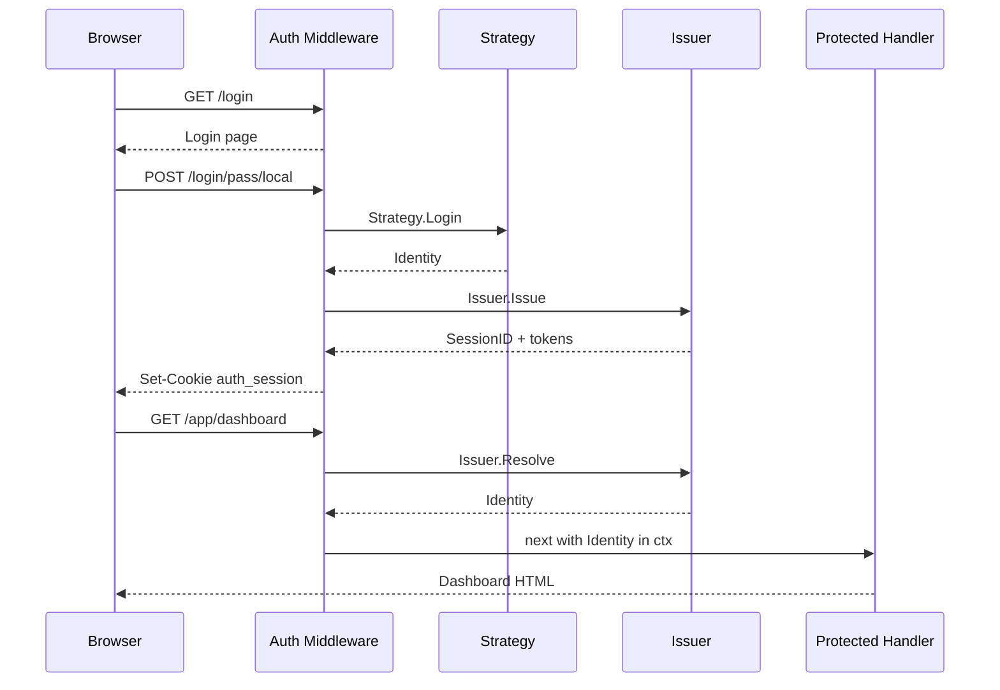
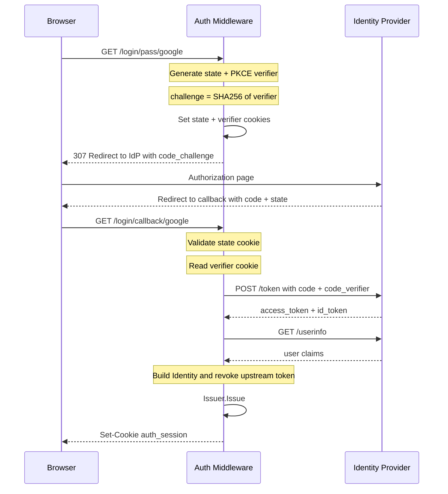
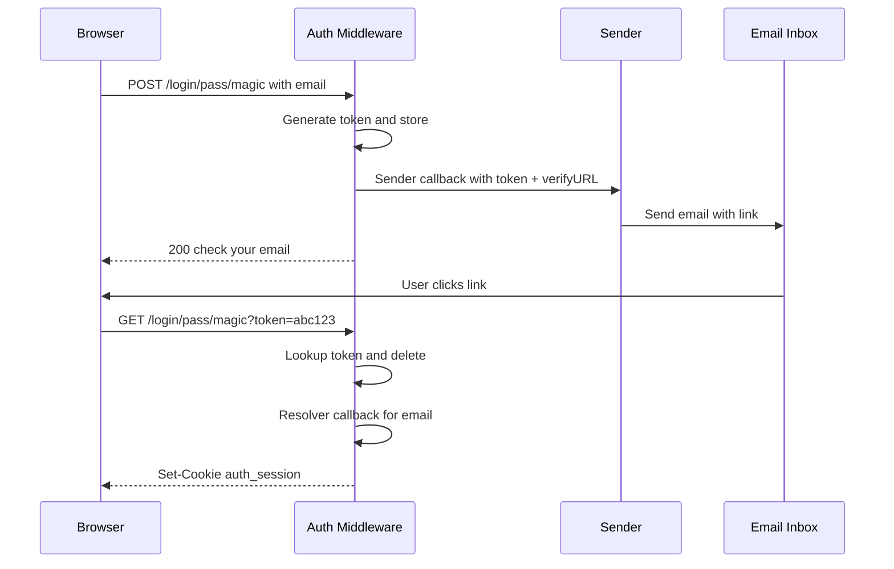

# Auth

Auth middleware provides a pluggable authentication system with session management, a built-in login UI, and support for multiple authentication strategies (local credentials, OAuth2/OIDC, custom).

```go
"github.com/rakunlabs/ada/middleware/auth"
"github.com/rakunlabs/ada/middleware/auth/strategy/local"
authoauth2 "github.com/rakunlabs/ada/middleware/auth/strategy/oauth2"
```

## How It Works

Authentication is a **one-shot event**. A strategy (OAuth2, local, etc.) verifies the user's identity once and returns a normalized `Identity`. The middleware then mints its own opaque session token — the upstream IdP token is discarded immediately (optionally revoked). Every subsequent request resolves the session cookie through the internal issuer, never touching the IdP again.



## Quick Start

```go
import (
    "github.com/rakunlabs/ada/middleware/auth"
    "github.com/rakunlabs/ada/middleware/auth/identity"
    "github.com/rakunlabs/ada/middleware/auth/strategy/local"
)

authMW := auth.New(auth.Config{
    UI: auth.UIConfig{
        Title:    "My App",
        Subtitle: "Sign in to continue",
    },
})

authMW.Strategy(local.New("local",
    func(ctx context.Context, user, pass string) (*identity.Identity, error) {
        // Your credential check (database, LDAP, etc.)
        if user == "admin" && pass == "secret" {
            return &identity.Identity{
                Subject: "admin",
                Email:   "admin@example.com",
                Roles:   []string{"admin"},
            }, nil
        }
        return nil, local.ErrInvalidCredentials
    },
    local.WithLabel("Email & password"),
))

if err := authMW.Init(ctx); err != nil {
    return err
}

// Mount public auth routes
authMW.Mount(mux)

// Protect routes
app := mux.Group("/app")
app.Use(authMW.Require())
app.GET("/dashboard", func(w http.ResponseWriter, r *http.Request) {
    id := identity.FromContext(r.Context())
    fmt.Fprintf(w, "Hello, %s", id.Name)
})
```

## Strategies

### Local Strategy

The local strategy authenticates using a user-supplied `Verifier` function. You own the credential check — it can be a database lookup, LDAP bind, bcrypt comparison, or anything else.

```go
import "github.com/rakunlabs/ada/middleware/auth/strategy/local"

authMW.Strategy(local.New("local",
    myVerifierFunc,
    local.WithLabel("Email & password"),
    local.WithPriority(0),
    local.WithFields(
        strategy.Field{Name: "email", Label: "Email", Type: "email", Required: true},
        strategy.Field{Name: "password", Label: "Password", Type: "password", Required: true},
    ),
))
```

The `Verifier` signature:

```go
type Verifier func(ctx context.Context, username, password string) (*identity.Identity, error)
```

Return `local.ErrInvalidCredentials` for bad credentials (produces 401). Any other error produces 500.

### OAuth2 / OIDC Strategy

The OAuth2 strategy supports the authorization code flow (with PKCE) and optional password flow.

```go
import authoauth2 "github.com/rakunlabs/ada/middleware/auth/strategy/oauth2"

authMW.Strategy(authoauth2.New("google", authoauth2.Config{
    IssuerURL:    "https://accounts.google.com",  // OIDC Discovery
    ClientID:     os.Getenv("GOOGLE_CLIENT_ID"),
    ClientSecret: os.Getenv("GOOGLE_CLIENT_SECRET"),
    Scopes:       []string{"openid", "email", "profile"},
}, authoauth2.Options{
    Label:            "Sign in with Google",
    CallbackBasePath: "/login/callback",
}))
```

#### OIDC Discovery

When `IssuerURL` is set, the strategy fetches `/.well-known/openid-configuration` to auto-populate:

| Discovered Field | Config Override |
|---|---|
| `authorization_endpoint` | `AuthURL` |
| `token_endpoint` | `TokenURL` |
| `userinfo_endpoint` | `UserInfoURL` |
| `revocation_endpoint` | `RevocationURL` |
| `end_session_endpoint` | `LogoutURL` |

Explicitly set fields always take precedence over discovered ones.

#### PKCE (Proof Key for Code Exchange)

PKCE is **enabled by default** for the authorization code flow (RFC 7636). The strategy generates a `code_verifier` + `code_challenge` pair per authorization request and includes them in the flow automatically.

Set `DisablePKCE: true` only if your IdP does not support it.



#### Manual Configuration (without Discovery)

```go
authoauth2.New("keycloak", authoauth2.Config{
    ClientID:      "my-app",
    ClientSecret:  "secret",
    AuthURL:       "https://kc.example.com/realms/main/protocol/openid-connect/auth",
    TokenURL:      "https://kc.example.com/realms/main/protocol/openid-connect/token",
    UserInfoURL:   "https://kc.example.com/realms/main/protocol/openid-connect/userinfo",
    RevocationURL: "https://kc.example.com/realms/main/protocol/openid-connect/revoke",
    LogoutURL:     "https://kc.example.com/realms/main/protocol/openid-connect/logout",
    Scopes:        []string{"openid", "email", "profile"},
}, authoauth2.Options{
    Label:            "Sign in with Keycloak",
    CallbackBasePath: "/login/callback",
})
```

### API Key Strategy

Header-based authentication for service-to-service or CLI access. No login UI — validates tokens from request headers.

```go
import "github.com/rakunlabs/ada/middleware/auth/strategy/apikey"

authMW.Strategy(apikey.New("apikey",
    func(ctx context.Context, key string) (*identity.Identity, error) {
        // Look up the key in your database
        user, err := db.FindByAPIKey(ctx, key)
        if err != nil {
            return nil, apikey.ErrInvalidKey
        }
        return &identity.Identity{
            Subject: user.ID,
            Email:   user.Email,
            Roles:   user.Roles,
        }, nil
    },
))
```

By default reads `Authorization: Bearer <token>` and falls back to `X-API-Key: <token>`. Customize with options:

```go
apikey.New("apikey", validator,
    apikey.WithHeaderName("X-Custom-Key"),  // read from a specific header
    apikey.WithBearerPrefix(false),         // don't strip "Bearer " prefix
)
```

::: info
API Key strategy is hidden from the login UI by default. It's designed for programmatic access alongside browser-based strategies.
:::

### LDAP Strategy

Username/password authentication against an LDAP directory (Active Directory, OpenLDAP). Uses the same login form as the local strategy.

```go
import "github.com/rakunlabs/ada/middleware/auth/strategy/ldap"

authMW.Strategy(ldap.New("ldap", ldap.Config{
    Address:      "ldap://ad.example.com:389",
    BaseDN:       "dc=example,dc=com",
    BindDN:       "cn=service,dc=example,dc=com",
    BindPassword: os.Getenv("LDAP_BIND_PASSWORD"),
    UserFilter:   "(sAMAccountName=%s)",  // default: "(uid=%s)"
    AttributeMap: ldap.AttributeMap{
        Subject: "sAMAccountName",
        Email:   "mail",
        Name:    "displayName",
        Roles:   "memberOf",
    },
}, myLDAPConnector,  // you provide the LDAP connection implementation
    ldap.WithLabel("Corporate Login"),
))
```

The strategy uses a `Connector` interface so it has zero external dependencies — you inject your LDAP library:

```go
type Connector interface {
    Connect(ctx context.Context) (Conn, error)
}

type Conn interface {
    Bind(dn, password string) error
    Search(baseDN, filter string, attributes []string) ([]Entry, error)
    Close() error
}
```

This means you can use `go-ldap`, `go-ldap/v3`, or any other LDAP library by wrapping it in this interface.

### Magic Link Strategy

Passwordless email-based authentication. User enters their email, receives a one-time link, and clicks it to log in.

```go
import "github.com/rakunlabs/ada/middleware/auth/strategy/magiclink"

authMW.Strategy(magiclink.New("magic", magiclink.Config{
    Sender: func(ctx context.Context, email, token, verifyURL string) error {
        // Send the magic link via your email service
        return emailService.Send(ctx, email, "Login link", verifyURL)
    },
    Resolver: func(ctx context.Context, email string) (*identity.Identity, error) {
        // Look up or create the user by email
        user, err := db.FindOrCreateByEmail(ctx, email)
        if err != nil {
            return nil, err
        }
        return &identity.Identity{
            Subject: user.ID,
            Email:   email,
            Name:    user.Name,
        }, nil
    },
    TokenTTL: 15 * time.Minute,
}, magiclink.WithLabel("Sign in with email")))
```

Flow:



The strategy ships with a built-in in-memory `TokenStore`. For production, provide your own Redis/DB-backed store:

```go
type TokenStore interface {
    Store(ctx context.Context, token, email string, ttl time.Duration) error
    Lookup(ctx context.Context, token string) (email string, err error)
    Delete(ctx context.Context, token string) error
}
```

### HTTP Basic Strategy

Standard HTTP Basic authentication (RFC 7617). The browser shows its native credential dialog — no login page needed.

```go
import "github.com/rakunlabs/ada/middleware/auth/strategy/basic"

authMW.Strategy(basic.New("basic",
    func(ctx context.Context, user, pass string) (*identity.Identity, error) {
        // Same Verifier signature as the local strategy
        if user == "admin" && pass == "secret" {
            return &identity.Identity{Subject: "admin"}, nil
        }
        return nil, basic.ErrInvalidCredentials
    },
    basic.WithRealm("My Application"),
))
```

When no `Authorization` header is present, the strategy responds with `401` + `WWW-Authenticate: Basic realm="My Application"` which triggers the browser's native login popup.

::: info
HTTP Basic is hidden from the login UI by default. It's useful for API endpoints, dev tools, or as a fallback when the browser-based UI isn't needed.
:::

### Header/Proxy Strategy

Trusts identity from headers set by an upstream reverse proxy (Traefik, nginx, Envoy). Zero user interaction — the proxy handles authentication.

```go
import "github.com/rakunlabs/ada/middleware/auth/strategy/header"

authMW.Strategy(header.New("proxy",
    header.WithHeaderMap(header.HeaderMap{
        User:   "X-Forwarded-User",   // → Identity.Subject
        Email:  "X-Forwarded-Email",  // → Identity.Email
        Name:   "X-Forwarded-Name",   // → Identity.Name
        Roles:  "X-Forwarded-Roles",  // comma-separated → Identity.Roles
        Groups: "X-Forwarded-Groups", // comma-separated → Identity.Claims["groups"]
    }),
))
```

All header names have sensible defaults (`X-Forwarded-User`, `X-Forwarded-Email`, etc.) so the minimal setup is:

```go
authMW.Strategy(header.New("proxy"))
```

If the User header is missing from the request, the strategy returns 401.

::: warning
Only use this behind a trusted reverse proxy that sets these headers. An attacker can forge them if the proxy is bypassed. Make sure your infrastructure strips these headers from external requests.
:::

### Multiple Strategies

Register multiple strategies — the login UI renders all of them automatically:

```go
authMW.Strategy(local.New("local", myVerifier, local.WithLabel("Email & password")))
authMW.Strategy(authoauth2.New("google", googleCfg, authoauth2.Options{Label: "Google"}))
authMW.Strategy(authoauth2.New("github", githubCfg, authoauth2.Options{Label: "GitHub"}))
authMW.Strategy(magiclink.New("magic", magicCfg, magiclink.WithLabel("Email link")))
authMW.Strategy(apikey.New("apikey", keyValidator))    // hidden from UI
authMW.Strategy(basic.New("basic", verifier))           // hidden, browser dialog
authMW.Strategy(header.New("proxy"))                    // hidden, proxy-injected
```

The UI groups them: form-based strategies (local, LDAP, magic link, password-flow OAuth2) show as tab-switchable forms; redirect-based strategies (OAuth2 code flow) show as buttons below an "or" divider. API key, basic, and header strategies are hidden from the UI.

## Configuration

### Auth Config

| Field | Type | Default | Description |
|---|---|---|---|
| `Base` | `string` | `"/"` | URL prefix for all auth routes |
| `UI.Title` | `string` | `"Sign in"` | Title shown on login page |
| `UI.Subtitle` | `string` | `""` | Text below the title |
| `UI.Icon` | `string` | `""` | Logo URL, data URI, inline SVG, or filename in embedded FS |
| `UI.Version` | `string` | `""` | Version text shown in header |
| `UI.ExternalFolder` | `bool` | `false` | Use your own login page instead of embedded UI |
| `CookieName` | `string` | `"auth_session"` | Session cookie name |
| `Cookie.Path` | `string` | `"/"` | Cookie path |
| `Cookie.MaxAge` | `int` | `0` | Cookie max-age in seconds |
| `Cookie.Domain` | `string` | `""` | Cookie domain |
| `Cookie.Secure` | `bool` | `false` | Cookie secure flag |
| `Cookie.HttpOnly` | `bool` | `false` | Cookie HttpOnly flag |
| `Cookie.SameSite` | `http.SameSite` | `Lax` | Cookie SameSite policy |
| `IssuerConfig.AccessTTL` | `time.Duration` | `15m` | Access token lifetime |
| `IssuerConfig.RefreshTTL` | `time.Duration` | `7d` | Refresh token lifetime |
| `IssuerConfig.RotateRefresh` | `bool` | `true` | Rotate refresh token on each refresh |

### OAuth2 Config

| Field | Type | Default | Description |
|---|---|---|---|
| `IssuerURL` | `string` | `""` | OIDC issuer URL for auto-discovery |
| `ClientID` | `string` | required | OAuth2 client ID |
| `ClientSecret` | `string` | required | OAuth2 client secret |
| `Scopes` | `[]string` | `[]` | Requested scopes |
| `AuthURL` | `string` | auto | Authorization endpoint |
| `TokenURL` | `string` | auto | Token endpoint |
| `UserInfoURL` | `string` | auto | UserInfo endpoint |
| `RevocationURL` | `string` | auto | Token revocation endpoint |
| `LogoutURL` | `string` | auto | End-session endpoint |
| `DisablePKCE` | `bool` | `false` | Disable PKCE (not recommended) |
| `PasswordFlow` | `bool` | `false` | Enable resource owner password flow |
| `AuthHeaderStyle` | `int` | `0` (Basic) | `0`=Basic, `1`=Bearer, `2`=Params |

## Routes

With default `Base: "/"`:

| Method | Path | Description |
|---|---|---|
| GET | `/login/` | Login UI (embedded Svelte or external folder) |
| GET | `/login/info` | JSON: title, subtitle, icon, version, strategies |
| GET | `/login/me` | Current user's Identity as JSON |
| GET/POST | `/login/pass/{strategy}` | Initiate or submit login |
| GET | `/login/callback/{strategy}` | OAuth2 redirect callback |
| POST | `/login/refresh` | Force-refresh access token |
| POST | `/logout` | Revoke session and clear cookie |
| GET | `/login/status` | Status iframe (for popup flow) |

## Identity

After `Require()`, the identity is available in the request context:

```go
id := identity.FromContext(r.Context())

id.Subject       // "alice"
id.Name          // "Alice Example"
id.Email         // "alice@example.com"
id.EmailVerified // true
id.Roles         // ["admin", "user"]
id.Scopes        // ["read", "write"]
id.Provider      // "local" or "google"
id.Claims        // map[string]any — raw OIDC claims
id.IssuedAt      // time.Time

// Typed claim access
tenantID := identity.Claim[string](id, "tenant_id")

// Role/scope checks
id.HasRole("admin")  // true
id.HasScope("write") // true
```

## Session & Issuer

The session is backed by an internal **issuer** that mints opaque access/refresh tokens:

- Browser cookie carries only an opaque session ID (never a JWT)
- Access tokens live for 15 minutes (configurable)
- Refresh tokens live for 7 days (configurable), rotated on each use
- Session state is stored in a pluggable backend (in-memory by default)

### Custom Issuer Backend

```go
import "github.com/rakunlabs/ada/middleware/auth/sessionstore/file"

store := file.New(file.Config{Path: "/var/sessions"}, sessionstore.Options{...})
authMW.WithSessionStore(store)
```

For Redis:

```go
import redisstore "github.com/rakunlabs/ada/middleware/auth/sessionstore/redis"

store, err := redisstore.New(ctx, redisstore.Config{
    Address:  "localhost:6379",
    Password: "secret",
}, sessionstore.Options{...})
authMW.WithSessionStore(store)
```

## Login UI

The middleware ships an embedded Svelte login page that reads `/login/info` to dynamically render:

- Form inputs per strategy (username/password, email/token, etc.)
- OAuth2 redirect buttons
- Strategy tabs when multiple form strategies exist
- Light/dark theme toggle (persisted to `localStorage`, respects `prefers-color-scheme`)
- Configurable title, subtitle, icon, and version

### Custom Login Page

Set `ExternalFolder: true` and mount your own handler:

```go
authMW := auth.New(auth.Config{
    UI: auth.UIConfig{ExternalFolder: true},
})

// After authMW.Mount(mux):
mux.GET("/login/", myCustomLoginHandler)
```

Your page should fetch `./info` (relative to the login path) to get strategy descriptors and render matching forms/buttons.

## Architecture

```mermaid
graph TD
    subgraph Auth Middleware
        A[auth.Mount] --> R[Routes]
        R --> INFO[/login/info]
        R --> LOGIN[/login/pass/strategy]
        R --> CALLBACK[/login/callback/strategy]
        R --> LOGOUT[/logout]
        R --> ME[/login/me]

        LOGIN --> REG[Strategy Registry]
        CALLBACK --> REG
        REG --> LOCAL[Local Strategy]
        REG --> OAUTH[OAuth2 Strategy]
        REG --> CUSTOM[Custom Strategy]

        LOCAL --> ID[Identity]
        OAUTH --> ID
        CUSTOM --> ID

        ID --> ISS[Issuer]
        ISS --> PAIR[SessionID + Access + Refresh]
        PAIR --> STORE[Session Store]
        STORE --> MEM[Memory]
        STORE --> FILE[File]
        STORE --> REDIS[Redis]
    end

    subgraph Protected Routes
        REQ[auth.Require] --> RESOLVE[Issuer.Resolve]
        RESOLVE --> CTX[WithIdentity in ctx]
        CTX --> NEXT[next handler]
    end

    A --> REQ
```

## Complete Example

```go
package main

import (
    "context"
    "fmt"
    "net/http"
    "os"

    "github.com/rakunlabs/ada"
    "github.com/rakunlabs/ada/middleware/auth"
    "github.com/rakunlabs/ada/middleware/auth/identity"
    "github.com/rakunlabs/ada/middleware/auth/strategy/local"
    authoauth2 "github.com/rakunlabs/ada/middleware/auth/strategy/oauth2"
)

func main() {
    ctx := context.Background()

    authMW := auth.New(auth.Config{
        UI: auth.UIConfig{
            Title:    "My Application",
            Subtitle: "Sign in to your account",
            Version:  "v1.0.0",
        },
    })

    // Local strategy
    authMW.Strategy(local.New("local", verifyUser,
        local.WithLabel("Email & password"),
    ))

    // OAuth2 with OIDC Discovery + PKCE (auto-enabled)
    if clientID := os.Getenv("GOOGLE_CLIENT_ID"); clientID != "" {
        authMW.Strategy(authoauth2.New("google", authoauth2.Config{
            IssuerURL:    "https://accounts.google.com",
            ClientID:     clientID,
            ClientSecret: os.Getenv("GOOGLE_CLIENT_SECRET"),
            Scopes:       []string{"openid", "email", "profile"},
        }, authoauth2.Options{
            Label:            "Sign in with Google",
            CallbackBasePath: "/login/callback",
        }))
    }

    if err := authMW.Init(ctx); err != nil {
        panic(err)
    }

    server, _ := ada.NewWithFunc(ctx, func(ctx context.Context, mux *ada.Mux) error {
        authMW.Mount(mux)

        mux.GET("/", func(w http.ResponseWriter, r *http.Request) {
            fmt.Fprintln(w, "Public homepage")
        })

        app := mux.Group("/app")
        app.Use(authMW.Require())
        app.GET("/dashboard", func(w http.ResponseWriter, r *http.Request) {
            id := identity.FromContext(r.Context())
            fmt.Fprintf(w, "Hello %s (%s)", id.Name, id.Provider)
        })

        return nil
    })

    server.Start(":8080")
}

func verifyUser(ctx context.Context, user, pass string) (*identity.Identity, error) {
    // Replace with your database lookup
    if user == "admin" && pass == "secret" {
        return &identity.Identity{
            Subject: "admin",
            Name:    "Admin User",
            Email:   "admin@example.com",
            Roles:   []string{"admin"},
        }, nil
    }
    return nil, local.ErrInvalidCredentials
}
```

::: warning
Always use `Cookie.Secure: true` and `Cookie.HttpOnly: true` in production.
The defaults are permissive for local development.
:::

::: danger
Never store secrets (`ClientSecret`, `SessionKey`) in source code. Use environment variables or a secret manager.
:::
